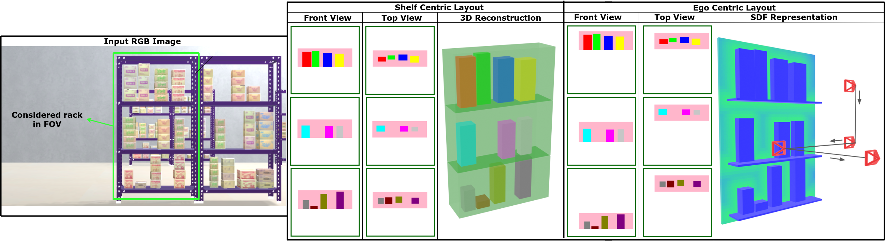

# RackLay: Monocular Multi-Layered Layout Estimation for Warehouses with Sim2Real Transfer


#### [Avinash Prabhu](https://avinash2468.github.io/), [Meher Shashwat Nigam](https://github.com/ShashwatNigam99), [Tanvi Karandikar](https://tanvi141.github.io/), [Anurag Sahu](https://anuragsahu.github.io/), Pranjali Pathre, Harit Pandya, [Ravi Kiran Sarvadevabhatla](https://ravika.github.io), and [K. Madhava Krishna](http://robotics.iiit.ac.in)

<!-- ####  [Video]( https://youtu.be/1hdl3W-MlXo) -->
<!-- [Paper](https://arxiv.org/abs/2002.08394) -->
<!-- #### Accepted to [WACV 2020](http://wacv20.wacv.net/) -->

<p align="center">
    
</p>


## Repository Structure

```
├── data # Store the *RackLay* data or custom data using *WareSynth* here.
├── racklay
│   ├── dataloader.py # Reading the data from the dataset and preparing it for training
│   ├── datasets.py
│   ├── __init__.py
│   ├── model.py # RackLay architecture defined here
│   └── resnet_encoder.py 
├── splits
│   └── warehouse
│       ├── train_files.txt # Indices to files from the dataset used for training
│       └── val_files.txt # Indices to files from the dataset used for validation
├── eval.py # Get metrics (mIOU and mAP) 
├── test.py # Get outputs on any required RGB images
├── train.py
└── utils.py 
```


## Installation

We recommend setting up a Python 3.7 Virtual Environment and installing all the dependencies listed in the requirements file. 

```
git clone https://github.com/Avinash2468/RackLay

cd RackLay
pip install -r requirements.txt
```

## Dataset

The *RackLay* dataset consists of two types of files- complex_12k.zip and simple_8k.zip for the complex and simple datasets as explained in the paper. We've presented results for complex *RackLay* dataset. 

## Download *RackLay* Dataset

http://bit.ly/racklay-dataset


## Understanding the dataset structure

```

├── Dataset
   ├── RGB Images
   ├── Top View Layouts
   ├── Front View Layouts

```

1. RGB Images- Images of size 470 x 280 x 3. They range between 000000.png to 011999.png. This can change depending on the data you may choose to generate using *WareSynth*

2. Top View Layouts- NPY files of size max_no_of_shelves x occ_map_size x occ_map_size. 

    - Here max_no_of_shelves represents the maximum number of shelves present in the dataset. In the complex_12k.zip case, it is 4. In the case a given datapoint has a rack with < max_no_of_shelves, those channels would be given 0 values.

    - Here occ_map_size represents the size of the layout itself. For the case of complex_12k.zip, it is 512.

3. Front View Layouts follow the same structure as Top View Layouts, except that they contain front views. 

## Training

Example code for training Racklay on different datasets in respective modes are provided below. Run the script with `--help` or `-h` flag to know more about the command line arguments that can be used to set precise training parameters.


```

# RackLay-D-disc (for top view or front view or both)
python train.py --type <both/topview/frontview> \
 --batch_size 32 \
 --num_epochs 251 \
 --split warehouse \
 --data_path ./data \
 --num_racks 4 \
 --log_frequency 50 \
 --occ_map_size 512

```


## Testing

To generate layouts predicted by a particular trained model, use the `test.py` code and specify specific the mode of training as well as the path to the model directory. Also specify the input image directory as well as the output directory where the predictions will be saved.
```

python test.py --image_path <path to the image directory> \
--out_dir <path to the output directory> \
--model_path <path to the model directory> \
--num_racks <max_no_of_shelves> \
--type <both/topview/frontview> \
--occ_map_size 512


```

## Evaluation

For evaluating a trained model use `eval.py` by specifying the mode used for training, the data split on which to evaluate as well as the path to the trained model directory. 

```
python eval.py --data_path ./data \
--pretrained_path <path to the model directory> \
--split warehouse \
--num_rack 4 \
--type <both/topview/frontview> \
--occ_map_size 512

```


<!-- ## Results

| KITTI  | Argoverse |
|:------:|:---------:|
|<p align="center"> </p> | <p align="center"></p>|
|<p align="center"></p> | <p align="center"></p>| -->
