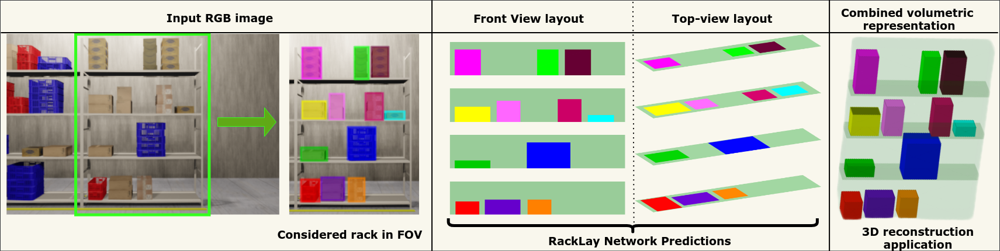

# RackLay: Multi-Layer Layout Estimation for Warehouse Racks

[Meher Shashwat Nigam](https://github.com/ShashwatNigam99), [Avinash Prabhu](https://avinash2468.github.io/), Anurag Sahu, Puru Gupta, [Tanvi Karandikar](https://tanvi141.github.io/), N. Sai Shankar, [Ravi Kiran Sarvadevabhatla](https://ravika.github.io), and [K. Madhava Krishna](http://robotics.iiit.ac.in)

#### Link to [Paper](https://arxiv.org/abs/2103.09174), [Code](https://github.com/Avinash2468/RackLay) 
#### Submitted to IROS 2021

<p align="center">
    
</p>

## [YouTube Video](https://www.youtube.com/watch?v=1hdl3W-MlXo)

<iframe height="500" width="800" src="https://www.youtube.com/embed/1hdl3W-MlXo" align="center" frameborder="0" allow="accelerometer; autoplay; encrypted-media; gyroscope; picture-in-picture" allowfullscreen></iframe>

## Abstract

To this end, we present RackLay, a deep neural network for real-time shelf layout estimation from a single image. Unlike previous layout estimation methods which provide a single layout for the dominant ground plane alone, RackLay estimates the top-view \underline{and} front-view layout for each shelf in the considered rack populated with objects. RackLay's architecture and its variants are versatile and estimate accurate layouts for diverse scenes characterized by varying number of visible shelves in an image, large range in shelf occupancy factor and varied background clutter. Given the extreme paucity of datasets in this space and the difficulty involved in acquiring real data from warehouses, we additionally release a flexible synthetic dataset generation pipeline WareSynth which allows users to control the generation process and tailor the dataset according to contingent application. The ablations across architectural variants and comparison with strong prior baselines vindicate the efficacy of RackLay as an apt architecture for the novel problem of multi-layered layout estimation. We also show that fusing the top-view and front-view enables 3D reasoning applications such as metric free space estimation for the considered rack.

## TL;DR

Multi-layered scene layout estimation from a single image @ >14 fps*

* Benchmarked on an Nvidia GeForce GTX 1080Ti GPU

## Contributions

* We solve for the first time, the problem of shelf layout estimation for warehouse rack scenes -- a problem pertinent in the context of both warehouse inventory management as well as futuristic warehouses managed by an autonomous robotic fleet.

* It proposes a novel architecture, the keynote of which is a shared context encoder, and most importantly a multi-channel decoder that infers the layout for each and every shelf in a given rack. We release for the first time, the *RackLay* synthetic dataset consisting of 20k RGB images along with layout annotations of shelves and objects in both the top and front view.

* More importantly, we open-source the flexible data generation pipeline *WareSynth*, along with relevant instructions that enable the researcher/user to create and customize their own warehouse scenes and generate 2D/3D ground truth annotations needed for their task automatically *WareSynth*. This does not restrict or limit the user to our dataset alone but provides for possibilities to create new datasets with the ability to customize as desired.

* We show tangible performance gain compared to other baseline architectures dovetailed and adapted to the problem of rack layout estimation. Moreover, we tabulate a number of ablations across  architectural variants which establish the efficacy and superiority of *RackLay*.

<p align="center">
    
</p>

The figure shows architecture diagram. It comprises of a context encoder, multi-channel decoders and adversarial discriminators.

If you find this work useful, please use the following BibTeX entry for citing us
```
@misc{nigam2021racklay,
      title={RackLay: Multi-Layer Layout Estimation for Warehouse Racks}, 
      author={Meher Shashwat Nigam and Avinash Prabhu and Anurag Sahu and Puru Gupta and Tanvi Karandikar and N. Sai Shankar and Ravi Kiran Sarvadevabhatla and K. Madhava Krishna},
      year={2021},
      eprint={2103.09174},
      archivePrefix={arXiv},
      primaryClass={cs.CV}
}
```
