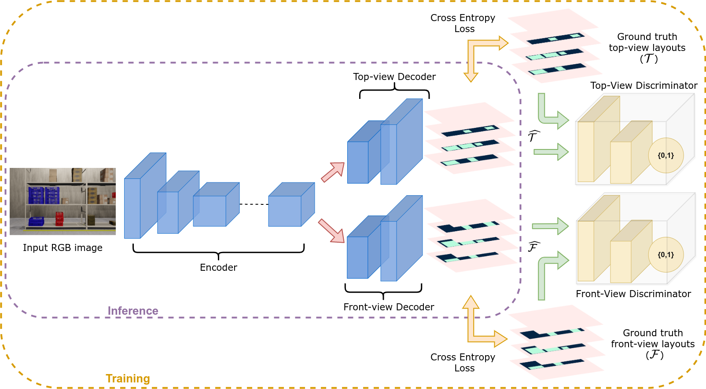

# RackLay: Monocular Multi-Layered Layout Estimation for Warehouses with Sim2Real Transfer

[Avinash Prabhu](https://avinash2468.github.io/), [Meher Shashwat Nigam](https://github.com/ShashwatNigam99), [Tanvi Karandikar](https://tanvi141.github.io/), [Anurag Sahu](https://anuragsahu.github.io/), Pranjali Pathre, Harit Pandya, [Ravi Kiran Sarvadevabhatla](https://ravika.github.io), and [K. Madhava Krishna](http://robotics.iiit.ac.in)

<p align="center">
    
</p>

## Link to [Paper](https://arxiv.org/abs/2103.09174), [Code](https://github.com/Avinash2468/RackLay), [Dataset](https://drive.google.com/drive/folders/1-GizhhfVOeyITYK0nIYpoyQPgtgALHvG?usp=sharing)
## Dataset Generation Pipeline: [Waresynth](https://anuragsahu.github.io/WareSynth/)

## [Teaser](https://youtu.be/9m5brJTAz50)

<iframe height="500" width="800" src="https://www.youtube.com/embed/1hdl3W-MlXo" align="center" frameborder="0" allow="accelerometer; autoplay; encrypted-media; gyroscope; picture-in-picture" allowfullscreen></iframe>

## Architecture

<p align="center">
    
</p>

Architecture comprises of a context encoder, multi-channel decoders and adversarial discriminators.

## How to cite
If you find this work useful, please use the following BibTeX entry for citing us
```
@misc{nigam2021racklay,
      title={RackLay: Multi-Layer Layout Estimation for Warehouse Racks}, 
      author={Meher Shashwat Nigam and Avinash Prabhu and Anurag Sahu and Puru Gupta and Tanvi Karandikar and N. Sai Shankar and Ravi Kiran Sarvadevabhatla and K. Madhava Krishna},
      year={2021},
      eprint={2103.09174},
      archivePrefix={arXiv},
      primaryClass={cs.CV}
}
```

## Contact information
- avinash.prabhu@students.iiit.ac.in
- meher.shashwat@students.iiit.ac.in
